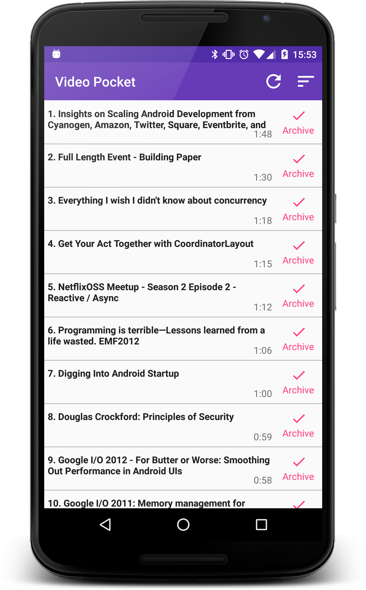

Video Pocket
============

Download your saved videos from Pocket, get their durations from the YouTube API, sort and show to the user. An experiment with RxJava + MVP.



Requires a [consumer key from Pocket](https://getpocket.com/developer/apps/new) and an [API key from YouTube](https://developers.google.com/youtube/registering_an_application?hl=en). 

Place both of these in a file linked in the project's `gradle.properties` in the following format:

```ini
pocket_app_id=yourpocketconsumerkeygoeshere
youtube_api_key=youtubeapikeygoeshere
```

The app is packaged by component, there are three component packages:

 - login, which is responsible for getting the user authenticated with Pocket, so we can retrieve their videos
 - video, which retrieves the list of saved videos from Pocket and their YouTube durations
 - storage, which contains the classes which persist user info (e.g. access token) and video info (a cached list of videos from Pocket)

The two presenters, VideoPresenter and LoginPresenter communicate with their views via an interface defined internally, which is implemented by their respective Activities.

The view interface for LoginPresenter looks as follows:

```java
    public interface View extends PresenterView {
        @NonNull Observable<Void> retrieveRequestToken();
        @NonNull Observable<Void> returnFromBrowser();

        void showLoadingView();
        void hideLoadingView();

        void showRequestTokenError();
        void showAccessTokenError();

        void startBrowser(final @NonNull String url);
        void startVideos();
    }
```

Methods starting with `show` are updating the UI, those starting with `start` will start another Activity.

Observables are exposed on this interface from the view, allowing the Presenters to subscribe to them in their lifecycle method, onViewAttached. A CompositeSubscription lives in the base class of Presenter, each subscription is added to this composite via the method `unsubscribeOnViewDetach`, which will unsubscribe from all subscriptions when the view is detached.

Presenters are injected into their views using Dagger. Supports device rotation with an in-memory cache of Dagger Components on the Application, handled by `BaseApplication`.

Unit tested to verify a reasonable number of possible scenarios:
 - successful retrieval and sorting of videos by their duration
 - updating the cache happens
 - if either network call fails, we hide the spinner and show error state
 - if Pocket API returns more videos than the YouTube API allows at once, that these requests are successfully batched
 - if subsequent refresh calls are discarded whilst one is in progress (if the user sitting there mashing the refresh button)

[](https://travis-ci.org/emmaguy/video-pocket)

License
--------

    Copyright 2015 Emma Guy

    Licensed under the Apache License, Version 2.0 (the "License");
    you may not use this file except in compliance with the License.
    You may obtain a copy of the License at

       http://www.apache.org/licenses/LICENSE-2.0

    Unless required by applicable law or agreed to in writing, software
    distributed under the License is distributed on an "AS IS" BASIS,
    WITHOUT WARRANTIES OR CONDITIONS OF ANY KIND, either express or implied.
    See the License for the specific language governing permissions and
    limitations under the License.
