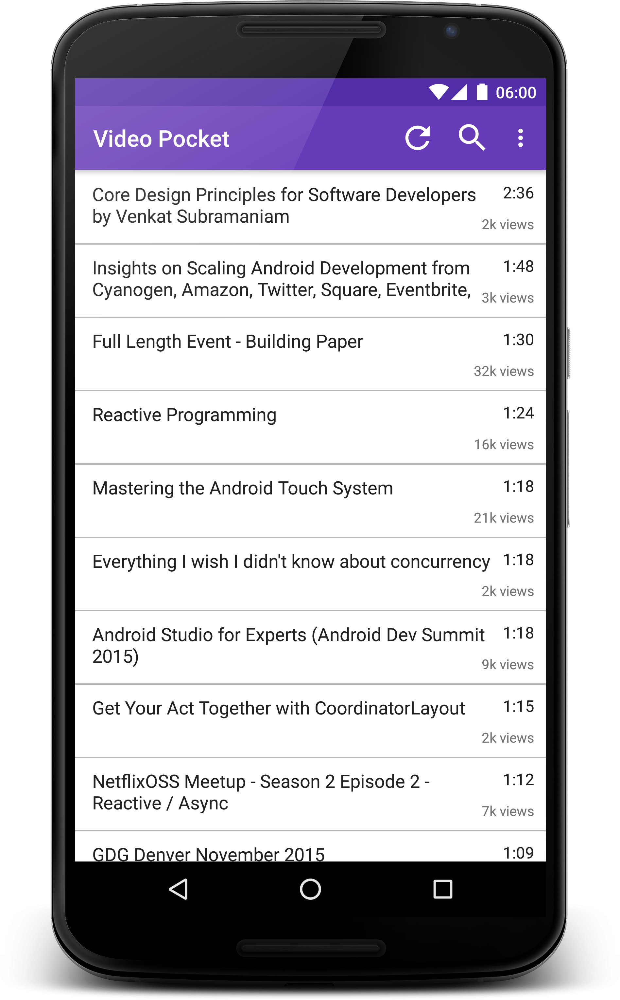

# Video Pocket

Download your saved videos from Pocket, get their durations from the YouTube API, sort and show to the user. An experiment with RxJava + MVP.



## Setup

Requires a [consumer key from Pocket](https://getpocket.com/developer/apps/new) and an [API key from YouTube](https://developers.google.com/youtube/registering_an_application?hl=en). 

Place both of these in a file on your local machine, and link it via the property `app.properties` which can be found in the project's `gradle.properties`.

Expected file format:
```ini
pocket_app_id=yourpocketconsumerkeygoeshere
youtube_api_key=youtubeapikeygoeshere
```

## Architecture

The app is packaged by component/feature, under the `com.emmaguy.videopocket.feature` package, to keep everything as private as possible. The components currently map 1-1 to Activities, but could easily use custom views instead.

Each component consists of a `Presenter` class, a `View` interface which the corresponding `Activity` implements and a Dagger `Module`/`Component` for dependencies. 

The `View` interface enables the `Presenter` to be pure Java and not have to know about anything Android:
```java
    public interface View extends PresenterView {
        @NonNull Observable<Void> retrieveRequestToken();

        void showLoadingView();
        void hideLoadingView();

        void startBrowser(@NonNull final String url);
    }
```

The interface exposes:
 - actions that the user can perform e.g. clicking a button, swiping, etc. (these are the methods that return `Observable<Object>`) 
    - we subscribe to each of these in the `Presenter`'s one lifecycle method, `onViewAttached`
    - each subscription is added to a `CompositeSubscription` via the method `unsubscribeOnViewDetach`, which will unsubscribe from all subscriptions when the view is detached
    - we limit what the `Presenter` is exposed to by using a return type of `Observable<Void>`, often it's enough just to know the action has happened
- actions which immediately update the view with a simple operation e.g. show or hide a progress bar (method name will usually starts with `show`/`hide`) 
- actions that start another Activity (prefixed with `start` e.g. `startBrowser`)

`Presenter`s are injected into their views using Dagger. Supports device rotation with an in-memory cache of Dagger Components on the Application, handled by `BaseApplication`.

There are currently two components:
 - login, which is responsible for getting the user authenticated with Pocket, so we can retrieve their videos
 - video, which retrieves the list of saved videos from Pocket and their YouTube durations

Additionally, there is a 'storage' package, which contains the classes which persist user information (e.g. access token) and video information (a cached list of videos from Pocket).

## Benefits

This setup has a number of advantages over a non-MVP app architecture
 - it separates our concerns
    - the `Presenter` is view agnostic and does not care how an action was triggered
    - the view which implements the `View` interface is very simple - the methods are usually one liners, doing something on the android `Activity` e.g. just setting a view's state to `View.GONE`
 - it allows us to place all our business logic within the `Presenter` object and abstracts the `View` for easy mocking, so we can unit test ALL THE THINGS, e.g: 
    - when we're doing a network request, does the loading indicator show when it starts, and hide when it ends?
    - are we ignoring clicks on the 'refresh' button when a network call doing a refresh is already in progress?
    - what happens when a network call fails?
    - is the cache being properly updated when we successfully retrieve data?
    - are we batching our requests correctly?
    - do we sort the videos correctly based on duration or time added to Pocket?
    - when a user uses the search feature, do the videos get filtered correctly?
    - ... etc 
 

[](https://travis-ci.org/emmaguy/video-pocket)

# License

    Copyright 2015 Emma Guy

    Licensed under the Apache License, Version 2.0 (the "License");
    you may not use this file except in compliance with the License.
    You may obtain a copy of the License at

       http://www.apache.org/licenses/LICENSE-2.0

    Unless required by applicable law or agreed to in writing, software
    distributed under the License is distributed on an "AS IS" BASIS,
    WITHOUT WARRANTIES OR CONDITIONS OF ANY KIND, either express or implied.
    See the License for the specific language governing permissions and
    limitations under the License.
